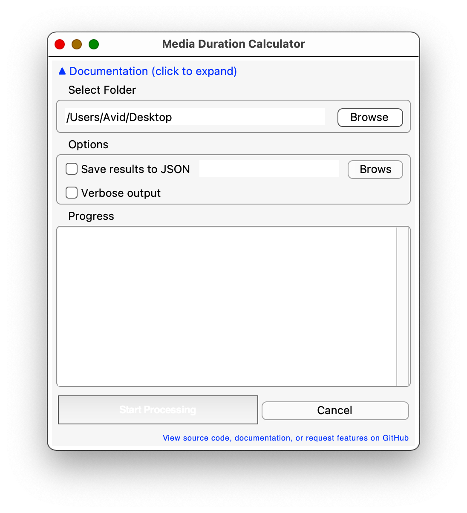

# MediaDurationRecursiveChecker

> Une version française de ce fichier README est disponible : [README_fr.md](README_fr.md)  
> A French version of this README is available: [README_fr.md](README_fr.md)



# MediaDurationRecursiveChecker

This Python script calculates the total duration of media files (video/audio) in a directory and estimates the total processing time. It was created to help estimate the total duration of daily/rush footage on a hard drive. The project was renamed from FileSizeTreeChecker to MediaDurationRecursiveChecker to better reflect its purpose.

## Features

- Supports common media formats: `.mp3`, `.mp4`, `.avi`, `.mkv`, `.mov`, `.wav`, `.flac`, `.mxf`, `.raw` (case-insensitive)
- Recursively scans directories
- Detects and reports duplicate files using SHA256 hashes
- Excludes hidden files (those starting with '.')
- Multi-threaded processing (configurable 1-16 threads) for faster performance
- Minimum file size filtering to skip small files
- Provides:
  - Total number of media files
  - Total size in GB
  - Total duration of all files with real-time estimation
  - Progress tracking with percentage completion
  - Verbose output with individual file durations
  - Comprehensive results saved to JSON file with detailed metadata
  - Duplicate file detection and grouping
  - Failed file tracking and reporting
  - Skipped file statistics

## Requirements

- Python 3.6+ (only tested on 3.8 and 3.11)
- `moviepy` (for media duration extraction)
- `pyperclip` (to handle copying and pasting the path)

## Installation and Usage

You have two options to run MediaDurationRecursiveChecker:

### 1. Run from Source (GUI)
1. Install required Python packages:
```bash
# Basic installation (all platforms):
pip install -r requirements.txt

# Platform-specific installation:
# For macOS:
pip install -r requirements-macos.txt
# For Linux:
pip install -r requirements-linux.txt
# For Windows:
pip install -r requirements-windows.txt

# For development:
pip install -r requirements-dev.txt
```
2. Ensure `ffmpeg` is installed on your system
3. Run the script:
```bash
python MediaDurationRecursiveChecker.py
```
4. Use the graphical interface to select folders and process files

### 2. Build Your Own Executable
If you prefer to build it yourself:
1. Install PyInstaller:
```bash
pip install pyinstaller
```
2. Build the executable:
```bash
pyinstaller --onefile --name MediaDurationRecursiveChecker MediaDurationRecursiveChecker.py --noconsole --hidden-import=imageio_ffmpeg
```
3. The executable will be in the `dist` directory

Note: This has been tested to work on macOS 11 when using the command:
```bash
sudo pyinstaller --onefile --windowed --name MediaDurationRecursiveChecker MediaDurationRecursiveChecker.py --clean
```

A pre-compiled .app for macOS is available in the 1.0.1 release.

## Output Example

```
Found 1234 media files (456.78 GB)
Processing files: 100%|████████████████████| 1234/1234 [12:34<00:00,  1.23it/s]
Current: 12h 34m | Estimated total: 15h 30m

Total duration: 15h 30m
Results saved to media_durations.json
```

## JSON Output Format

The output JSON file contains comprehensive information:
```json
{
  "summary": {
    "total_files": 1234,
    "processed_files": 1200,
    "skipped_files": 34,
    "min_file_size_kb": 100,
    "total_size_gb": 456.78,
    "total_duration_seconds": 55800,
    "total_duration_readable": "15h 30m",
    "failed_files_count": 5,
    "duplicate_groups_count": 3,
    "total_duplicate_files": 8
  },
  "files": {
    "/path/to/file.mp4": {
      "duration": 3600,  // in seconds
      "size": 1048576,   // in bytes
      "hash": "sha256_hash_here"
    }
  },
  "duplicate_groups": [
    ["/path/to/file1.mp4", "/path/to/duplicate1.mp4"],
    ["/path/to/file2.avi", "/path/to/duplicate2.avi"]
  ],
  "failed_files": [
    "/path/to/corrupted_file.mp4"
  ]
}
```

## Additional Features

- **GUI remembers last used folder** for convenience
- **Configurable processing threads** (1-16) to optimize performance based on your system
- **Minimum file size threshold** to skip tiny files that might not be actual media
- **Debug mode** available for troubleshooting duration extraction issues
- **Collapsible documentation** built into the GUI
- **Platform-specific optimizations** for better cross-platform compatibility
- **Keyboard shortcuts** for common operations (Ctrl+A, Ctrl+C, Ctrl+V)

## Notes

- Files are processed in random order to provide better time estimates
- The script handles errors gracefully, skipping files it can't process
- Duplicate detection uses SHA256 hashes for accurate identification
- Multi-threading significantly improves processing speed on modern systems
- Skipped files (below minimum size) are tracked separately and don't affect duration calculations
