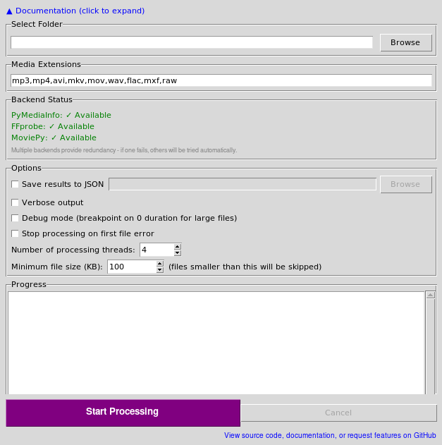

# MediaDurationRecursiveChecker

> Une version anglaise de ce fichier README est disponible : [README.md](README.md)  
> An English version of this README is available: [README.md](README.md)



# MediaDurationRecursiveChecker

Ce script Python calcule la durée totale des fichiers multimédias (vidéo/audio) dans un répertoire et estime le temps total de traitement. Il a été créé pour aider à estimer la durée totale des rushs quotidiens sur un disque dur. Le nom du projet a été changé de FileSizeTreeChecker à MediaDurationRecursiveChecker pour mieux refléter sa fonctionnalité principale.

## Fonctionnalités

- Supporte les formats multimédias courants : `.mp3`, `.mp4`, `.avi`, `.mkv`, `.mov`, `.wav`, `.flac`, `.mxf`, `.raw` (insensible à la casse)
- Parcourt les répertoires de manière récursive
- Détecte et signale les fichiers dupliqués en utilisant des hachages SHA256
- Exclut les fichiers cachés (ceux commençant par '.')
- Traitement multi-threadé (1-16 threads configurables) pour de meilleures performances
- Filtrage par taille minimale de fichier pour ignorer les petits fichiers
- Fournit :
  - Le nombre total de fichiers multimédias
  - La taille totale en Go
  - La durée totale de tous les fichiers avec estimation en temps réel
  - Suivi du progrès avec pourcentage d'achèvement
  - Sortie détaillée avec les durées individuelles des fichiers
  - Résultats complets sauvegardés dans un fichier JSON avec métadonnées détaillées
  - Détection et regroupement des fichiers dupliqués
  - Suivi et rapport des fichiers en échec
  - Statistiques des fichiers ignorés

## Prérequis

- Python 3.6+ (seulement testé sur 3.8 et 3.11)
- `moviepy` (pour l'extraction de la durée des médias)
- `pyperclip` (pour gérer le copier-coller du chemin)

## Installation et Utilisation

Vous avez deux options pour exécuter MediaDurationRecursiveChecker :

### 1. Exécuter depuis les sources (interface graphique)
1. Installer les packages Python requis :
```bash
# Installation de base (toutes plateformes) :
pip install -r requirements.txt

# Installation spécifique à la plateforme :
# Pour macOS :
pip install -r requirements-macos.txt
# Pour Linux :
pip install -r requirements-linux.txt
# Pour Windows :
pip install -r requirements-windows.txt

# Pour le développement :
pip install -r requirements-dev.txt
```
2. S'assurer que `ffmpeg` est installé sur le système
3. Exécuter le script :
```bash
python MediaDurationRecursiveChecker.py
```
4. Utiliser l'interface graphique pour sélectionner les dossiers et traiter les fichiers

### 2. Compiler votre propre exécutable
Si vous préférez le compiler vous-même :
1. Installer PyInstaller :
```bash
pip install pyinstaller
```
2. Compiler l'exécutable :
```bash
pyinstaller --onefile --name MediaDurationRecursiveChecker MediaDurationRecursiveChecker.py --noconsole --hidden-import=imageio_ffmpeg
```
3. L'exécutable sera dans le répertoire `dist`

Note : Cela a été testé pour fonctionner sur macOS 11 en utilisant la commande :
```bash
sudo pyinstaller --onefile --windowed --name MediaDurationRecursiveChecker MediaDurationRecursiveChecker.py --clean
```

Une version pré-compilée .app pour macOS est disponible dans la release 1.0.1.

## Exemple de sortie

```
1234 fichiers multimédias trouvés (456.78 Go)
Traitement des fichiers : 100%|████████████████████| 1234/1234 [12:34<00:00,  1.23it/s]
Actuel : 12h 34m | Total estimé : 15h 30m

Durée totale : 15h 30m
Résultats sauvegardés dans media_durations.json
```

## Format de sortie JSON

Le fichier JSON de sortie contient des informations complètes :
```json
{
  "summary": {
    "total_files": 1234,
    "processed_files": 1200,
    "skipped_files": 34,
    "min_file_size_kb": 100,
    "total_size_gb": 456.78,
    "total_duration_seconds": 55800,
    "total_duration_readable": "15h 30m",
    "failed_files_count": 5,
    "duplicate_groups_count": 3,
    "total_duplicate_files": 8
  },
  "files": {
    "/chemin/vers/fichier.mp4": {
      "duration": 3600,  // en secondes
      "size": 1048576,   // en octets
      "hash": "hash_sha256_ici"
    }
  },
  "duplicate_groups": [
    ["/chemin/vers/fichier1.mp4", "/chemin/vers/duplique1.mp4"],
    ["/chemin/vers/fichier2.avi", "/chemin/vers/duplique2.avi"]
  ],
  "failed_files": [
    "/chemin/vers/fichier_corrompu.mp4"
  ]
}
```

## Fonctionnalités additionnelles

- **L'interface se souvient du dernier dossier utilisé** pour plus de commodité
- **Threads de traitement configurables** (1-16) pour optimiser les performances selon votre système
- **Seuil de taille minimale de fichier** pour ignorer les petits fichiers qui ne sont peut-être pas des médias réels
- **Mode debug** disponible pour résoudre les problèmes d'extraction de durée
- **Documentation repliable** intégrée dans l'interface graphique
- **Optimisations spécifiques à la plateforme** pour une meilleure compatibilité multiplateforme
- **Raccourcis clavier** pour les opérations courantes (Ctrl+A, Ctrl+C, Ctrl+V)

## Notes

- Les fichiers sont traités dans un ordre aléatoire pour fournir de meilleures estimations de temps
- Le script gère les erreurs avec élégance, en sautant les fichiers qu'il ne peut pas traiter
- La détection des doublons utilise des hachages SHA256 pour une identification précise
- Le multi-threading améliore significativement la vitesse de traitement sur les systèmes modernes
- Les fichiers ignorés (en dessous de la taille minimale) sont suivis séparément et n'affectent pas les calculs de durée
